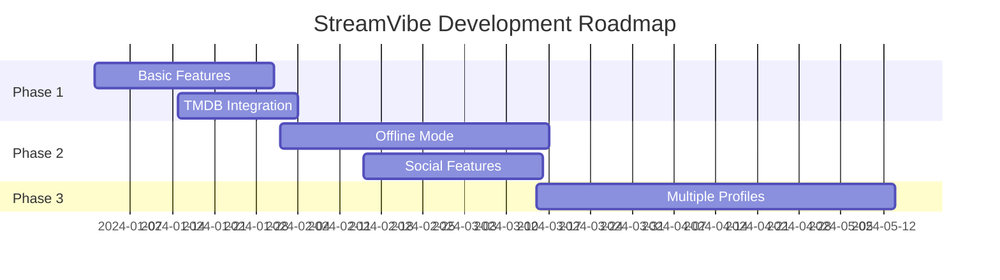

# 🎬 StreamVibe - React Native OTT App

```plaintext
   _______ __                            _    _____ __          
  / ___/ // /_________  ____ _____ ___  | |  / /  _/ /_  _____ 
  \__ \/ // __/ ___/ _ \/ __ `/ __ `__ \ | | / // // __ \/ ___/
 ___/ / // /_/ /  /  __/ /_/ / / / / / / | |/ // // /_/ (__  ) 
/____/_/ \__/_/   \___/\__,_/_/ /_/ /_/  |___/___/_.___/____/  
```

[](https://reactnative.dev/)
[](https://www.themoviedb.org/documentation/api)
[](https://expo.dev/)
[](./LICENSE)

> A feature-rich streaming application built with React Native and powered by TMDB API. Watch trailers, discover movies and TV shows, and keep track of your favorite content.

## 📱 Preview

```
Insert your app screenshots here
```

## ✨ Features

```markdown
🎥 Extensive Movie & TV Show Library
🎯 Personalized Recommendations
🔍 Advanced Search & Filters
🌟 Rating & Reviews
📺 Trailer Playback
💾 Offline Download Support
👤 User Profiles
🌙 Dark/Light Theme
🔐 Secure Authentication
📱 Cross-Platform (iOS & Android)
```

## 🛠️ Tech Stack

```javascript
{
  "frontend": {
    "main": "React Native",
    "state": "Redux Toolkit",
    "ui": ["React Native Paper", "React Native Elements"],
    "navigation": "React Navigation v6",
    "video": "React Native Video",
    "storage": "Async Storage"
  },
  "backend": {
    "api": "TMDB API",
    "auth": "Firebase Auth",
    "storage": "Firebase Storage"
  }
}
```

## ⚡ Installation

### Prerequisites

```bash
# Required installations
node >= 16.0.0
npm >= 8.0.0
react-native-cli
expo-cli
```

### Setting Up Development Environment

1. **Clone and Install**

```bash
# Clone the repository
git clone https://github.com/yourusername/streamvibe.git

# Navigate to project directory
cd streamvibe

# Install dependencies
npm install

# Install pods for iOS
cd ios && pod install && cd ..
```

2. **Environment Configuration**

Create a `.env` file in the root directory:

```env
TMDB_API_KEY=your_tmdb_api_key
FIREBASE_API_KEY=your_firebase_api_key
FIREBASE_AUTH_DOMAIN=your_auth_domain
FIREBASE_PROJECT_ID=your_project_id
FIREBASE_STORAGE_BUCKET=your_storage_bucket
FIREBASE_MESSAGING_SENDER_ID=your_sender_id
FIREBASE_APP_ID=your_app_id
```

3. **Start Development Server**

```bash
# Using Expo
expo start

# Using React Native CLI
npm run android
# or
npm run ios
```

## 📁 Project Structure

```plaintext
streamvibe/
├── src/
│   ├── api/
│   │   ├── tmdb.js
│   │   └── firebase.js
│   ├── components/
│   │   ├── MovieCard/
│   │   ├── VideoPlayer/
│   │   └── CustomHeader/
│   ├── navigation/
│   │   ├── AppNavigator.js
│   │   └── AuthNavigator.js
│   ├── screens/
│   │   ├── Home/
│   │   ├── Search/
│   │   └── Profile/
│   ├── store/
│   │   ├── reducers/
│   │   └── actions/
│   └── utils/
├── assets/
├── App.js
└── package.json
```

## 🔧 API Integration

### TMDB API Setup

```javascript
// src/api/tmdb.js
import axios from 'axios';

const tmdbApi = axios.create({
  baseURL: 'https://api.themoviedb.org/3',
  params: {
    api_key: process.env.TMDB_API_KEY,
  },
});

export const getMovies = async () => {
  try {
    const response = await tmdbApi.get('/movie/popular');
    return response.data;
  } catch (error) {
    console.error('Error fetching movies:', error);
    throw error;
  }
};
```

## 📱 Screen Examples

### Home Screen

```javascript
// src/screens/Home/HomeScreen.js
import React from 'react';
import { View } from 'react-native';
import { MovieList, FeaturedContent } from '@/components';

const HomeScreen = () => {
  return (
    <View style={styles.container}>
      <FeaturedContent />
      <MovieList category="popular" />
      <MovieList category="upcoming" />
    </View>
  );
};
```

## 🧪 Testing

```bash
# Run tests
npm test

# Run with coverage
npm run test:coverage

# Run specific test file
npm test MovieCard.test.js
```

## 📈 Performance Optimization

```markdown
1. Image Caching
2. Lazy Loading
3. Infinite Scrolling
4. Memory Management
5. API Response Caching
```

## 🚀 Deployment

### Android

```bash
# Generate release APK
cd android
./gradlew assembleRelease
```

### iOS

```bash
# Using Xcode
Open ios/StreamVibe.xcworkspace
Select 'Product' > 'Archive'
```

## 🤝 Contributing

```bash
# Create branch
git checkout -b feature/AmazingFeature

# Commit changes
git commit -m 'Add AmazingFeature'

# Push branch
git push origin feature/AmazingFeature
```

## 📝 License

```plaintext
MIT License

Copyright (c) 2024 StreamVibe

Permission is hereby granted...
```

## 🎯 Roadmap



## 🔧 Troubleshooting

<details>
<summary>Common Issues</summary>

```markdown
1. Build Errors
   - Clear watchman: `watchman watch-del-all`
   - Clear metro: `npm start -- --reset-cache`

2. iOS Issues
   - Clean build: `cd ios && pod deintegrate`
   - Reinstall pods: `pod install`

3. Android Issues
   - Clean gradle: `cd android && ./gradlew clean`
```
</details>

## 📞 Support

```yml
Email: support@streamvibe.com
Discord: discord.gg/streamvibe
Documentation: docs.streamvibe.com
```

## 📚 Resources

```markdown
- [React Native Documentation](https://reactnative.dev/docs/getting-started)
- [TMDB API Documentation](https://developers.themoviedb.org/3)
- [Expo Documentation](https://docs.expo.dev)
- [React Navigation](https://reactnavigation.org/docs/getting-started)
```

---

<div align="center">

**[Website](https://streamvibe.com)** • 
**[Documentation](https://docs.streamvibe.com)** • 
**[Report Bug](https://github.com/yourusername/streamvibe/issues)** • 
**[Request Feature](https://github.com/yourusername/streamvibe/issues)**

Made with ❤️ by Sajal Mahajan(https://github.com/sajalg364)

</div>
